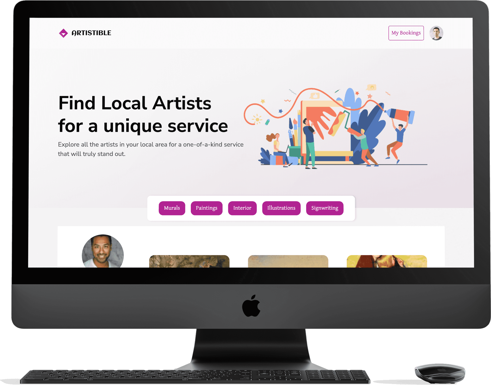

<!--
*** Thanks for checking out the Best-README-Template. If you have a suggestion
*** that would make this better, please fork the repo and create a pull request
*** or simply open an issue with the tag "enhancement".
*** Don't forget to give the project a star!
*** Thanks again! Now go create something AMAZING! :D
-->

<!-- PROJECT SHIELDS -->
<!--
*** I'm using markdown "reference style" links for readability.
*** Reference links are enclosed in brackets [ ] instead of parentheses ( ).
*** See the bottom of this document for the declaration of the reference variables
*** for contributors-url, forks-url, etc. This is an optional, concise syntax you may use.
*** https://www.markdownguide.org/basic-syntax/#reference-style-links
-->

[![Contributors][contributors-shield]][contributors-url]
[![Forks][forks-shield]][forks-url]
[![Stargazers][stars-shield]][stars-url]
[![Issues][issues-shield]][issues-url]
[![LinkedIn][linkedin-shield]][linkedin-url]

<!-- PROJECT LOGO -->
 

  <h1 align="center">Artistible</h1>
  
  
   

  <strong align="center">
    Discover local artists and book their services.
  
   <a href="https://github.com/alvara/artistible/issues">Report Bug</a>・
   <a href="https://github.com/alvara/artistible/issues">Request Feature</a>
  </strong>

<!-- ABOUT THE PROJECT -->
## Learn More
You can find more in depth information about the development of this project [here](https://jessealvarado.com/portfolio/artistible)

## Built With

This project was built with the following technology:

* Framework built on [Ruby on Rails](https://rubyonrails.org/)
* Styled with [Bootstrap](https://getbootstrap.com)
* Deployed on [Heroku](https://heroku.com/)

## How to Get Started
1. Clone this repository
2. `rails db:migrate`
3. create user account 
4. `rails db:seed`
5. `bundle install`
6. `yarn install`

<!-- LICENSE -->
## License

Distributed under the MIT License.
* [View licenses](https://choosealicense.com)

<!-- CONTACT -->
## Contact Developer

Jesse Alvarado - contact@jessealvarado.com

My Site: [jessealvarado.com](https://jessealvarado.com)

<!-- MARKDOWN LINKS & IMAGES -->
<!-- https://www.markdownguide.org/basic-syntax/#reference-style-links -->
[contributors-shield]: https://img.shields.io/github/contributors/alvara/artistible.svg?style=for-the-badge
[contributors-url]: https://github.com/alvara/artistible/graphs/contributors
[forks-shield]: https://img.shields.io/github/forks/alvara/artistible.svg?style=for-the-badge
[forks-url]: https://github.com/alvara/artistible/network/members
[stars-shield]: https://img.shields.io/github/stars/alvara/artistible.svg?style=for-the-badge
[stars-url]: https://github.com/alvara/artistible/stargazers
[issues-shield]: https://img.shields.io/github/issues/alvara/artistible.svg?style=for-the-badge
[issues-url]: https://github.com/alvara/artistible/issues
[license-shield]: https://img.shields.io/github/license/alvara/artistible.svg?style=for-the-badge
[license-url]: https://github.com/alvara/alvara/artistible/blob/master/LICENSE.txt
[linkedin-shield]: https://img.shields.io/badge/-LinkedIn-black.svg?style=for-the-badge&logo=linkedin&colorB=555
[linkedin-url]: https://linkedin.com/in/jesse-alvarado
[product-screenshot]: images/screenshot.png

